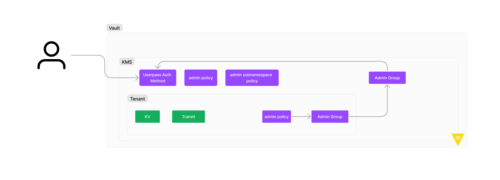

# terraform-vault-multitenant-policies
a quick TF code to showcase creating child admin groups that adds a parent group to its members of tenant specific policies



this terraform code shows how a parent admin can manage many child namespaces while maintaining the child admin policies specific to each namespace.

by leveraging groups it is possible to set a Parent Admin Group as a Member of a Child Admin Group; then the admin policies for the child namespace are set at the Child Admin Group level. 

to run this TF code all that is needed is your Vault specific enviroment variables(example of HCP Vault specific enviroment variables):

```bash
export VAULT_ADDR=https://<HCP_VAULT_ADDR>
export VAULT_NAMESPACE=admin
export VAULT_TOKEN=hunter2
```

this example uses a token attached to a token role (so it creates an entitiy we can add to the parent group)

you will see all of the child namespace policies when doing a vault token lookup 

example of the commands to test can be found in the vault_create_token.sh script

```bash
vault token create -display-name=admin -entity-alias=tf_alias -role=test-role -namespace=admin/parent

Key                  Value
---                  -----
token                hvs.CAESIJzzLy2VOmlOWSgVor5JplVvMczhG-pf28gUF-Sx_l2YGikKImh2cy5MdVdtSWlyRzNyWW1lMG0zeTBFQjJPWmUuV0ZDdjIQ15vHAg
token_accessor       FpWBdxaleHRf2is6vWcdrIrk.WFCv2
token_duration       24h
token_renewable      true
token_policies       ["default"]
identity_policies    []
policies             ["default"]
```

```bash
vault token lookup hvs.CAESIJzzLy2VOmlOWSgVor5JplVvMczhG-pf28gUF-Sx_l2YGikKImh2cy5MdVdtSWlyRzNyWW1lMG0zeTBFQjJPWmUuV0ZDdjIQ15vHAg
Key                            Value
---                            -----
accessor                       FpWBdxaleHRf2is6vWcdrIrk.WFCv2
creation_time                  1707752276
creation_ttl                   24h
display_name                   token-admin
entity_id                      3f387db2-256d-a9dc-4abc-0118ab91c3e9
expire_time                    2024-02-13T15:37:56.670434273Z
explicit_max_ttl               0s
external_namespace_policies    map[C8iSJ:[default vault-admin-kms] IjWAl:[default vault-admin-kms] cGpOe:[default vault-admin-kms]]
id                             hvs.CAESIJzzLy2VOmlOWSgVor5JplVvMczhG-pf28gUF-Sx_l2YGikKImh2cy5MdVdtSWlyRzNyWW1lMG0zeTBFQjJPWmUuV0ZDdjIQ15vHAg
identity_policies              [default vault-admin-kms]
issue_time                     2024-02-12T15:37:56.670443222Z
meta                           <nil>
namespace_path                 admin/parent/
num_uses                       0
orphan                         false
path                           auth/token/create/test-role/path-suffix
policies                       [default]
renewable                      true
role                           test-role
ttl                            23h59m35s
type                           service
```

in the external_namespace_policies, we can see the policies for the different namespaces.

```bash
external_namespace_policies    map[C8iSJ:[default vault-admin-kms] IjWAl:[default vault-admin-kms] cGpOe:[default vault-admin-kms]]
```
